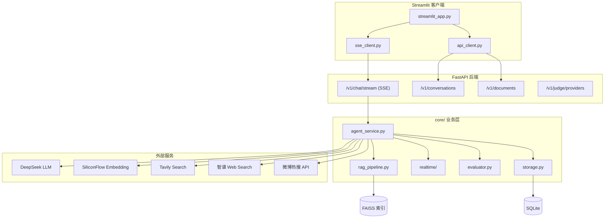

# Advanced DeepSearch Agent

[](https://www.python.org/)
[](https://fastapi.tiangolo.com/)
[](https://python.langchain.com/)

面向生产场景的多工具 AI Agent：**联网搜索 + 本地文档 RAG + 实时数据插件 + 质量评测**，采用 **FastAPI SSE 后端 + Streamlit 薄客户端** 前后端分离架构。

> 仓库地址：[github.com/jingjingzi1103/DeepSearch_Agent](https://github.com/jingjingzi1103/DeepSearch_Agent)

---

## 核心能力

| 模块 | 说明 |
|------|------|
| **多工具 Agent** | LangChain `AgentExecutor`，动态组装 Tavily / 智谱搜索 / 微博热搜 / 本地 RAG |
| **文档 RAG** | PDF/TXT → 切片 → BGE-M3 Embedding → FAISS 检索，会话级向量库隔离 |
| **强制链路** | 文档问答、微博热搜等场景绕过 Agent 自行调工具，保证检索必达 |
| **实时数据** | 微博热搜（无需 Key）、智谱 Web Search（中文新闻/热点） |
| **跨平台 Guard** | 防止用 A 平台搜索结果推断 B 平台热榜（如抖音 vs 微博） |
| **LLM-as-Judge** | 多 Provider 交叉评测（DeepSeek / 智谱），分数持久化 |
| **SSE 流式对话** | `POST /v1/chat/stream` 推送 status / token / trace / judge 事件 |
| **会话记忆** | SQLite 持久化消息、Trace、评测；历史滑动窗口（最近 10 条） |

---

## 架构概览



---

## 快速开始

### 1. 克隆与安装

```bash
git clone https://github.com/jingjingzi1103/DeepSearch_Agent.git
cd DeepSearch_Agent
pip install -r requirements.txt
```

### 2. 配置环境变量

复制模板并填入你的 Key（**切勿将 `.env` 提交到 Git**）：

```bash
cp .env.example .env   # Linux / macOS
# Windows PowerShell: Copy-Item .env.example .env
```

必填项：

```env
DEEPSEEK_API_KEY=your_deepseek_api_key
TAVILY_API_KEY=your_tavily_api_key
SILICONFLOW_API_KEY=your_siliconflow_api_key
```

可选项见 [.env.example](.env.example) 全文。

Key 申请地址：

| 变量 | 用途 | 申请 |
|------|------|------|
| `DEEPSEEK_API_KEY` | 主对话 LLM | [platform.deepseek.com](https://platform.deepseek.com) |
| `TAVILY_API_KEY` | 联网搜索 | [tavily.com](https://tavily.com) |
| `SILICONFLOW_API_KEY` | BGE-M3 Embedding | [siliconflow.cn](https://siliconflow.cn) |
| `ZHIPU_API_KEY` | 智谱 Web Search | [open.bigmodel.cn](https://open.bigmodel.cn) |

自检脚本：

```bash
python scripts/check_keys.py
```

### 3. 启动服务

**推荐：前后端分离（两个终端）**

```bash
# 终端 1 — API 后端
uvicorn api.main:app --reload --port 8000 --reload-dir api --reload-dir core

# 终端 2 — Streamlit 客户端
streamlit run client/streamlit_app.py
```

浏览器打开 Streamlit 默认地址（一般为 `http://localhost:8501`）。

兼容旧入口（仍需先启动 API）：

```bash
streamlit run advanced_agent.py
```

客户端可通过环境变量指定后端地址：

```env
API_BASE_URL=http://127.0.0.1:8000
```

---

## 使用说明

1. **上传文档（可选）**：侧边栏上传 PDF/TXT，系统自动解析、切片、Embedding 并写入本会话的 FAISS 索引。
2. **提问**：
   - 文档相关问题 → 强制走 `local_knowledge_search`
   - 微博热搜 → 强制走 `weibo_hot_search`
   - 中文新闻/热点 → 优先 `zhipu_web_search`，必要时 Tavily
3. **查看 Trace**：每条回答下方可展开来源链接与工具调用链。
4. **Judge 评分**：回答完成后自动展示质量评分（可在侧边栏切换 Provider）。
5. **会话管理**：新建 / 切换 / 重命名 / 删除会话；每个会话的消息与向量库相互隔离。

---

## API 接口

启动后端后访问 **http://127.0.0.1:8000/docs** 查看 Swagger 文档。

| 方法 | 路径 | 说明 |
|------|------|------|
| `GET` | `/health` | 轻量存活探针 |
| `GET` | `/health/deep` | 深度检查（探测 DeepSeek Key） |
| `POST` | `/v1/chat/stream` | SSE 流式对话 |
| `GET/POST/DELETE` | `/v1/conversations` | 会话 CRUD |
| `GET` | `/v1/conversations/{id}/messages` | 获取消息历史 |
| `PATCH` | `/v1/conversations/{id}` | 重命名会话 |
| `GET` | `/v1/conversations/{id}/evaluations` | 获取 Judge 评分记录 |
| `POST` | `/v1/conversations/{id}/documents/upload` | 上传文档并建索引 |
| `GET` | `/v1/conversations/{id}/documents/status` | 查询向量库状态 |
| `GET` | `/v1/judge/providers` | 列出可用 Judge Provider |

**SSE 事件类型**：`status` · `token` · `trace` · `judge` · `done` · `error`

---

## 项目结构

```text
DeepSearch_Agent/
├── api/                       # FastAPI 后端
│   ├── main.py                # 应用入口
│   ├── sse.py                 # SSE 格式化
│   ├── schemas.py             # 请求/响应模型
│   └── routes/                # chat / conversations / documents / judge
├── client/                    # Streamlit 薄客户端
│   ├── streamlit_app.py       # 推荐入口
│   ├── sse_client.py          # SSE 消费
│   ├── api_client.py          # REST 客户端
│   ├── http_client.py         # httpx 封装
│   └── components.py          # UI 组件
├── core/                      # 业务逻辑（与 UI/API 解耦）
│   ├── agent_service.py       # Agent 构建与对话执行
│   ├── rag_pipeline.py        # 强制 RAG 链路
│   ├── realtime/              # 微博热搜、智谱搜索
│   ├── evaluator.py           # LLM-as-Judge
│   ├── platform_guard.py      # 跨平台幻觉防护
│   ├── storage.py             # SQLite + FAISS 路径
│   └── ...
├── tests/                     # pytest（46 项，不依赖外部 API）
├── eval/cases.json            # 手工/E2E 评测用例
├── docs/                      # 分阶段开发文档
├── scripts/check_keys.py      # API Key 自检
├── advanced_agent.py          # 兼容旧入口
├── .env.example               # 环境变量模板（可提交）
├── chat_history.db            # 运行时生成，已 gitignore
└── faiss_index_store/         # 运行时生成，已 gitignore
```

---

## 测试

```bash
pytest tests/ -v
```

测试覆盖：会话存储、FAISS 路径隔离、历史窗口、意图识别、RAG 链路、Judge 解析、API 路由、SSE 客户端等。**全部使用 Mock，无需真实 API Key。**

---

## 环境变量一览

| 变量 | 必填 | 默认值 | 说明 |
|------|------|--------|------|
| `DEEPSEEK_API_KEY` | ✅ | — | DeepSeek 对话模型 |
| `TAVILY_API_KEY` | ✅ | — | Tavily 联网搜索 |
| `SILICONFLOW_API_KEY` | ✅ | — | BGE-M3 Embedding |
| `ZHIPU_API_KEY` | ❌ | — | 智谱 Web Search |
| `ENABLE_WEIBO_HOT` | ❌ | `true` | 启用微博热搜工具 |
| `ENABLE_ZHIPU_SEARCH` | ❌ | `true` | 启用智谱搜索（需 Key） |
| `ZHIPU_SEARCH_ENGINE` | ❌ | `search_pro` | 智谱搜索引擎类型 |
| `JUDGE_PROVIDER` | ❌ | `deepseek` | Judge：`deepseek` / `zhipu` |
| `JUDGE_MODEL` | ❌ | 各 Provider 默认 | 覆盖 Judge 模型名 |
| `LANGCHAIN_TRACING_V2` | ❌ | `false` | LangSmith 追踪开关 |
| `LANGCHAIN_API_KEY` | ❌ | — | LangSmith API Key |
| `API_BASE_URL` | ❌ | `http://127.0.0.1:8000` | 客户端连接的后端地址 |

---

## 安全说明

- **`.env` 已在 `.gitignore` 中**，不会被 Git 跟踪。
- 代码中**不硬编码**任何 API Key，统一通过 `core/env_loader.py` 读取。
- 提交前请执行 `git status`，确认列表中没有 `.env`、`chat_history.db`、`faiss_index_store/`。
- 若 Key 曾误提交，请立即在各平台**轮换 Key**，并从 Git 历史中彻底清除。

---

## 常见问题

**Q：刷新页面后文档索引不见了？**  
向量库按会话隔离，需确认当前会话存在 `faiss_index_store/conv_<id>/` 目录。

**Q：遇到 503 / 403？**  
503 为服务端繁忙，系统会自动重试；403 多为 API 频率/配额限制，请控制请求频率或升级配额。

**Q：Embedding 报 413？**  
已对批量 Embedding 做 `chunk_size=64` 限制；若仍报错，请检查文档是否过大。

**Q：为什么 Agent 有时不调用工具？**  
文档问答、微博热搜等场景已走**强制链路**，不依赖 Agent 自行决策；其余场景由 Prompt 硬规则约束。

---

## 技术栈

Python · FastAPI · SSE · Streamlit · LangChain · FAISS · SQLite · DeepSeek · Tavily · SiliconFlow (BGE-M3) · 智谱 GLM

---

## 文档

| 文档 | 内容 |
|------|------|
| [docs/PHASE1_GUIDE.md](docs/PHASE1_GUIDE.md) | 质量保障与 pytest 入门 |
| [docs/PHASE2_GUIDE.md](docs/PHASE2_GUIDE.md) | Judge 评测体系 |
| [docs/REALTIME_GUIDE.md](docs/REALTIME_GUIDE.md) | 实时数据插件与 Trace |
| [docs/PHASE3_PLAN.md](docs/PHASE3_PLAN.md) | FastAPI + SSE 分离架构 |

---

## License

MIT（或按你的实际需要修改）
